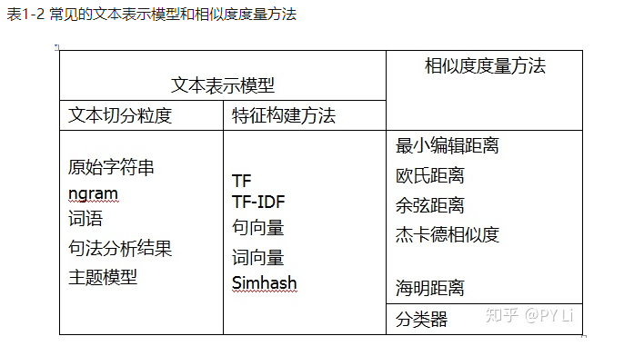

#### 描述

超过175万件
利用3-gram 的 Jaccard 係数を来检测重复度 样本集交集与样本集合集
但是ご飯とライス之类的漢字，ひらがな，カタカナなど，複数の表記方法を持つ材料が存在する
以及一般用户错别字比较多
单纯的3-gram重复检测准确率低

所以不只要考虑文字一致性，也要考虑文本含义的一致性

Sparse Composite Document Vectors
WMD+3-gram词向量

这两种和3-gram 的 Jaccard结果差不多

所以最后决定用BERT

#### SOAT
一份好的词向量+word mover distance

1. 基于 料理文本的embedding距离给重複レシピペア候補排序
2. 根据材料的不同给重複レシピペア候補排序
3. 基于WMD给重複レシピペア候補排序

### 使用的BERT
柴田
1. 日本語 Wikipedia の全データ（約 1,800 万文，半角を全角に変換）
2. Juman++ 分词，Bite Pair Encoding (BPE) [26] を適用し subword [2] に分割
3. 双方向 Transformer 12 層，隠れ状態ベクトル 768 次元，Attention のヘッド数 8 個
4. 学習エポック数: 30 回
5. 語彙数: 32,000 語（形態素，subword を含む）
6. 最大入力長: 128

出力される系列の先頭にある [CLS] トークンの埋め込み表現を調理手順テキストの埋め込み表現として利用する．
本研究是用了 CLS token来作为文本的向量 （dim:768）

# 第一步

以下の手順によってオリジナルレシピ候補の材料集合と重複レシピ候補の材
料集合間の材料相違数を算出する．
原始文本候补的材料集合和重复文本候补的材料集合间的材料相违数根据以下顺序计算：
1. 两个文本的材料列表中：去除记号，括弧内文字
>例如「〇にんにく」＝＞「にんにく」去除记号
>「リンゴ（東京産）」＝＞「リンゴ」去掉括号内文字

2. 将材料名全部统一成全角片假名（pykakasi），将两种食谱之间完全一致的材料从两种食谱的材料列表中删除

3. 对于重复文本候补的各材料，以使用食谱数据学习的单词的分散表现为基础，检索类似单词（gensim3）。类似单词的检索结果，前五名中含有原食谱候补材料的情况，视为同一材料从材料列表中删除作为查询的材料和类似单词提取的材料。

4. 把两种食谱的材料清单中的要素合计数作为材料差异数。

目的：
材料差异数不大于2的抽取出来作为重复文本的候选，进行下一步

# 第二步：重複レシピペア候補の WMD の算出

# 比较手法
基于WMD
3-gram + jaccard   先3 gram分割，再利用jaccard  
>jacard：两个句子词汇的交集size除以两个句子词汇的并集size
tfi df

#总结
