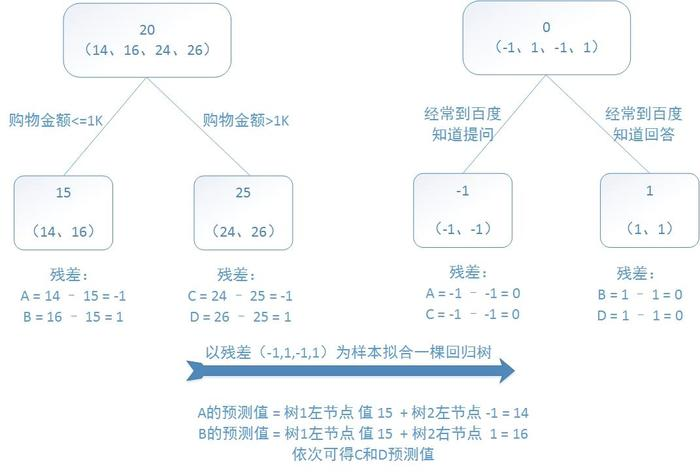
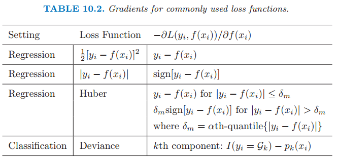

* content
{:toc}

#### 总览
梳理一下GBDT的脉络
1. Decision Tree
首先，决策树是基本模型
2. Boosting Decision Tree
提升树算法
然后用Boosting的方法来采用加法向前的模型，利用多颗决策树来提升算法，这时候就是Boosting Decision Tree
当采用**==平方误差损失函数 #F44336==**时，每一棵回归树学习的是之前所有树的结论和残差，拟合得到一个当前的残差回归树，残差的意义如公式：残差 = 真实值 - 预测值 。提升树即是整个迭代过程生成的回归树的累加。如下图：
>

3. Gradient Boosting Decision Tree：梯度提升决策树
 为什么多了个梯度呢？
 这是为了修改上述 Boosting Decision Tree的不足    
 在Boosting Decision Tree中，当损失函数为 **==平方损失 #F44336==** 和 **==指数损失函数 #F44336==** 时，每一步的优化很简单，如平方损失函数学习残差回归树。
 
 但是但对于一般的损失函数，往往每一步优化没那么容易，如上图中的绝对值损失函数和Huber损失函数。针对这一问题，Freidman提出了梯度提升算法：利用最速下降的近似方法，即利用损失函数的负梯度在当前模型的值，作为回归问题中提升树算法的残差的近似值，拟合一个回归树。
 
 
GBDT（Gradient Boosting Decision Tree）梯度提升决策树
决策树分为回归树和分类树，GBDT是基于回归树 

Gradient:梯度，也就是一阶导数
残差：$y-F(x)$ 也就是损失值
##### 为什么梯度提升方法倾向于选择决策树作为基学习器呢？
(也就是 GB 为什么要和 DT 结合，形成 GBDT) 决策树可以认为是 if-then 规则的集合，易于理解，可解释性强，预测速度快。同时，决策树算法相比于其他的算法需要更少的特征工程，比如可以不用做特征标准化，可以很好的处理字段缺失的数据，也可以不用关心特征间是否相互依赖等。决策树能够自动组合多个特征。

作者：腾讯云技术社区
链接：https://zhuanlan.zhihu.com/p/53980138
来源：知乎
著作权归作者所有。商业转载请联系作者获得授权，非商业转载请注明出处。

#### 梯度和残差的关系
>$X={x_1,x_2,...,x_n}$
>$Y={y_1,y_2,...,y_n}$
>原模型$F(X)$
>目标：最小化平方损失函数$\frac{1}{2}\sum(y_i-F(x_i)^2)$
>缺点：$F(X)$不可能完美，总有残差出现
>我们用一个模型来拟合残差
>此时
>>$X={x_1,x_2,...,x_n}$
>$Y={y_1-F(x_1),y_2-F(x_2),...,y_n-F(x_n)}$

在平方损失函数中，我们对$F(x_i)$求一阶导数
$$\frac{\partial \frac{1}{2}\sum(y_i-F(x_i)^2)}{\partial F(x_i)}=F(x_i)-y_i$$
可以看到残差等于负梯度

#### 基于残差的GBDT对异常值敏感

#### 什么是GBDT
GBDT是加法模型（由于GBDT是回归树，数值可以简单相加，也可以）
$$F=(f_1,f_2,...,f_k)$$
$$\hat{y}_i=\sum \limits_{k=1}^{K}f_k(x_i)$$
#### 如何来学习加法模型呢？
解这一优化问题，可以用前向分布算法（forward stagewise algorithm）。因为学习的是加法模型，如果能够从前往后，每一步只学习一个基函数及其系数（结构），逐步逼近优化目标函数，那么就可以简化复杂度。这一学习过程称之为 **Boosting**。具体地，我们从一个常量预测开始，每次学习一个新的函数，过程如下
某一步的预测值都等于前面

#### Regression Decision Tree：回归树
由于GBDT是回归模型，所以我们从回归树开始讲起
回归树的每个节点都会得到一个具体的值，区别于决策树得到的是 01值

#### Boosting Decision Tree：提升树算法
提升树就是利用多棵回归树来提升
组合方法A-->B-->C-->D
第一颗树A拟合的是真实数值，后面的树拟合的就是前一棵树的残差值
例：
训练一个提升树模型来预测年龄：
  训练集是4个人，A，B，C，D年龄分别是14，16，24，26。样本中有购物金额、上网时长、经常到百度知道提问等特征。提升树的过程如下：
 
可以看到提升树利用加法模型和前向分步算法来优化
- 加法模型：最终预测值等于前面每一颗树的预测值相加
- 前向分步：就是第一棵树到最后一颗树一个一个来

- 优化
通过启发式方法，每步找出一个合适的特征值s，将训练数据分成不同的小区间；每一步我们需要计算预测值和实际值之间的误差，那么预测值怎么算呢，我们取每个区间的均值作为该区间的预测值。

#### Gradient Boosting Decision Tree：梯度提升决策树
为什么会出现梯度提升决策树，跟上面的提升树算法有什么区别
>对于提升树算法来说，当损失函数时平方损失和指数损失函数时，每一步的优化很简单，如平方损失函数学习残差回归树。
但是，但对于一般的损失函数，往往每一步优化没那么容易，如上图中的绝对值损失函数和Huber损失函数

>针对这一问题，Freidman提出了梯度提升算法：**利用最速下降的近似方法，即利用损失函数的负梯度在当前模型的值**，作为回归问题中提升树算法的残差的近似值，拟合一个回归树。（注：鄙人私以为，与其说负梯度作为残差的近似值，不如说残差是负梯度的一种特例）

也就是说，两者的区别，前者拟合残差，后者拟合负梯度
##### 为什么要拟合负梯度，而不是拟合残差
**就是因为残差不好优化**
##### 那为什么不直接用平方损失函数
因为平方损失函数对异常值敏感，所以一般回归类的损失函数会用绝对损失或者huber损失函数来代替

#### XGBDT
XGBDT是GBDT的一种工程实现

Reference
https://blog.csdn.net/qq_39521554/article/details/80714945
作者：腾讯云技术社区
链接：https://zhuanlan.zhihu.com/p/53980138
来源：知乎
著作权归作者所有。商业转载请联系作者获得授权，非商业转载请注明出处。
