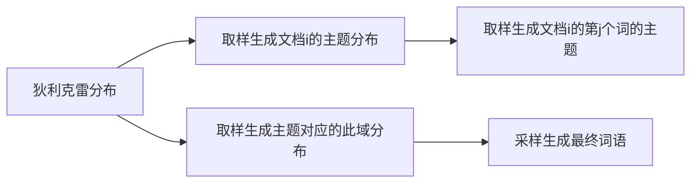

作者：jaylou娄杰
链接：https://zhuanlan.zhihu.com/p/56382372
来源：知乎
著作权归作者所有。商业转载请联系作者获得授权，非商业转载请注明出处。

本文根据知乎文章中的QA填写

## 文本表示和各词向量间的对比 
### 文本表示哪些方法？
#### 词袋模型（bags of words）
 常用的用one-hot,tf-idf
>one-hot：将离散特征映射到欧式空间的最简单的方法，但是
>1. 语义鸿沟
>2. 维度爆炸
>3. 不能反映词序特征
>4. 单词的重要程度没有体现
>5. 没有体现特征词的分布特征

>tf-idf(term frequency-inverse document frequency)
tf:词频（某个单词数/总词数）
idf:逆文档频率（log(总文档数/包含某个单词的文档数量)）
>
>优点：
>1. 中心思想就是利用某类文档独有的高频词来分类（利用体育新闻中高频词篮球足球，娱乐新闻中电影明星来分类），
>2. 有效忽略了常见词（例如我们，大家）等一些不能用来作为分类特征的单词
>
>缺点：
>1. 没有词序特征
>2. 语义鸿沟
>4. 没有体现特征词的分布特征

——————————————————
总结
可以看到词袋模型的缺点几乎一致
#### N-gram

>基于统计语言模型，基本思想是窗口滑动来得到多个长度为N的片段，**基本假设是第N个词的出现只与前面N-1个词相关，而与其它任何词都不相关，整句的概率就是各个词出现概率的乘积**。这些概率可以通过直接从语料中统计N个词同时出现的次数得到。

> 在评估句子是否合理的时候 例如 $S=\{w_1,w_2,...,w_m\}$,求句子的合理性公式为 $P=p(w_1)p(w_2|w_1)p(w_3|w_1,w_2)...p(w_m|{w1,...,w_m-1})$
> 显然计算太复杂，这时候就可以利用n-gram缩小计算量：$P=p(w_1)p(w_2|w_1)p(w_3|w_1,w_2)...p(w_m|{w1,...,w_m-1})$
> 根据贝叶斯定理 $P(w_i)=C(\frac{w_iw_{i-1}}{C_{i-1}})$
> 推导：$p(w_i|w_{i-1})=\frac {p(w_iw_{i-1})}{p(w_{i-1})}= \frac{\frac{count(w_i,w{i-1})}{count(allWords)}}{\frac{count(w{i-1})}{count(allWords)}}$
> 很好理解 求$w_i$在$w{i-1}$情况下的概率就是$w_{i},w_{i-1}$共现次数除以$w_{i-1}$的次数，因为$w_{i-1}$出现的次数包含了$w_{i},w_{i-1}$出现的情况

==推导3，4gram #E91E63==

 #### 主题模型
 是一种词袋模型：**一篇文章是由一组单词组成，单词之间没有先后顺序**
基本假设：
1. 文档包含多个主题
2. 每个主题有多个单词

基本思想：
由1，2假设可得到，已知一篇文档的主题，我们相信这个主题相关的单词更可能出现在这篇文档中

潜在语义分析（LSA）
1. 生成文档-术语矩阵D,矩阵的每一行代表一个文档，每一列代表单词，具体数值可以是单词的出现次数，也可以用tf-idf来为矩阵指定权重，这样可以体现单词的重要性$W_{i,j}=tf_{i,j} * log{\frac {N}{df_i}}$

2. 利用矩阵D来寻找主题，但是矩阵D可能很稀疏，用截断SVD来做，所以要先做奇异值分解

####  词向量
- 静态 word2vec, fastText, glove
- 动态 elmo, GPT, bert

##### 传统的词向量有什么问题？怎么解决？各种词向量的特点是什么？

**分布式假设**：上下文语境相同的单词有相似含义

>One-hot 表示 ：维度灾难、语义鸿沟；

>分布式表示 (distributed representation) ：
> - 矩阵分解（LSA）：利用全局语料特征，但SVD求解计算复杂度大；
>  - 基于NNLM/RNNLM的词向量：词向量为副产物，存在效率不高等问题；
>  - word2vec、fastText：优化效率高，但是基于局部语料；
>  -  glove：基于全局预料，结合了LSA和word2vec的优点；
>  -  elmo、GPT、bert：动态特征；

##### word2vec vs NNLM
>其本质都可以看作是语言模型

>词向量只不过NNLM一个产物，word2vec虽然其本质也是语言模型，但是其专注于词向量本身，因此做了许多优化来提高计算效率：
> - 与NNLM相比，词向量直接sum，不再拼接，并舍弃隐层；
> - 考虑到sofmax归一化需要遍历整个词汇表，采用hierarchical softmax 和negative sampling进行优化，hierarchical softmax 实质上生成一颗带权路径最小的哈夫曼树，让高频词搜索路劲变小；negative sampling更为直接，实质上对每一个样本中每一个词都进行负例采样；

##### word2vec vs fastText
>都可以无监督学习词向量， fastText训练词向量时会考虑subword；

> fastText还可以进行有监督学习进行文本分类，其主要特点：
> - 结构与CBOW类似，但学习目标是人工标注的分类结果；
> - 采用hierarchical softmax对输出的分类标签建立哈夫曼树，样本中标签多的类别被分配短的搜寻路径；
> - 引入N-gram，考虑词序特征；
> - 引入subword来处理长词，处理未登陆词问题；

##### word2vec vs glove vs LSA

7、 elmo、GPT、bert三者之间有什么区别？（elmo vs GPT vs bert）
##### word2vec

>word2vec的两种模型
>>CBOW:已知 w的context，预测w
>>skip-gram已知w，预测contex

>>这里CBOW，projection是将词向量相加而不是拼接，并且舍弃了隐层，目的是为了减少计算量。问题在于，这些牺牲对词向量的性能影响有多大，体现在哪里

2、word2vec的两种优化方法是什么？它们的目标函数怎样确定的？训练过程又是怎样的？
三、深入解剖Glove详解
1、GloVe构建过程是怎样的？
2、GloVe的训练过程是怎样的？
3、Glove损失函数是如何确定的？
四、深入解剖bert（与elmo和GPT比较）
1、为什么bert采取的是双向Transformer Encoder，而不叫decoder？
2、elmo、GPT和bert在单双向语言模型处理上的不同之处？
3、bert构建双向语言模型不是很简单吗？不也可以直接像elmo拼接Transformer decoder吗？
4、为什么要采取Marked LM，而不直接应用Transformer Encoder？
5、bert为什么并不总是用实际的[MASK]token替换被“masked”的词汇？
###马尔可夫
1. 将随机变量作为结点，若两个随机变量相关或者不独立，则将二者连接一条边；若给定若干随机变量，则形成一个有向图，即构成一个网络。
2. 如果该网络是有向无环图，则这个网络称为贝叶斯网络。
3. 如果这个图退化成线性链的方式，则得到马尔可夫模型；因为每个结点都是随机变量，将其看成各个时刻(或空间)的相关变化，以随机过程的视角，则可以看成是马尔可夫过程。
4. 若上述网络是无向的，则是无向图模型，又称马尔可夫随机场或者马尔可夫网络。
5. 如果在给定某些条件的前提下，研究这个马尔可夫随机场，则得到条件随机场。
6. 如果使用条件随机场解决标注问题，并且进一步将条件随机场中的网络拓扑变成线性的，则得到线性链条件随机场。

作者：mantch
链接：https://zhuanlan.zhihu.com/p/74063873
来源：知乎
著作权归作者所有。商业转载请联系作者获得授权，非商业转载请注明出处。