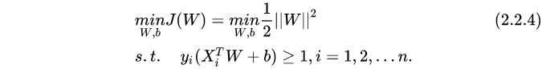
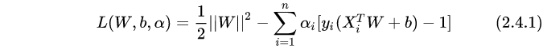

###回归
作者：Ryan Fan
链接：https://www.zhihu.com/question/33489751/answer/60478383
来源：知乎
著作权归作者所有。商业转载请联系作者获得授权，非商业转载请注明出处。

1、linear regression 是最原始的回归，用来做数值类型的回归（有点绕，是为了区别“分类”），比如你可以利用它构建模型，输入你现在的体重、每天卡路里的摄入量、每天运动量等，预测你一个月的体重会是多少

2、曲线回归，我更喜欢称之为“多项式回归”，是为了让弥补普通线性回归不擅长处理非线性问题而设计的，它给自变量加上一些适合当前问题的非线性特征（比如指数等等），让模型可以更好地拟合当前非线性问题。
3、logistic regression，它主要是用来分析当因变量是分类变量的情况，且由于本身带有一丝的非线性特征，所以在处理非线性问题时，模型表现的也挺好

>逻辑回归与线性回归的关系
>>线性回归使用最小二乘法作为参数估计方法，逻辑回归使用极大似然法作为参数估计方法
>>logistic回归是分析**因变量取某个值的概率与自变量的关系**，而线性回归是**直接分析因变量与自变量的关系**
>>

### SVM

感知机的目标: 找到一个超平面使其能正确地将每个样本正确分类。
1. 线性可分（硬间隔）
2. 近似线性可分（软间隔）
3. 非线性（核技巧+软间隔最大化）

>为什么对偶
>>对偶问题更易求解，由下文知对偶问题只需优化一个变量[公式]且约束条件更简单；
>>能更加自然地引入核函数，进而推广到非线性问题。

##### 硬间隔最大化步骤
首先，间隔最大化的数学表达是：

引入拉格朗日乘子

根据拉格朗日对偶性，式[公式]所述问题即原始问题的对偶问题是:

##### 软间隔最大化
解决该问题的一个办法是允许SVM在少量样本上出错，即将之前的硬间隔最大化条件放宽一点，为此引入“软间隔(soft margin)”的概念。即允许少量样本不满足约束

为了使不满足上述条件的样本点尽可能少，我们需要在优化的目标函数里面新增一个对这些点的惩罚项。最常用的是hinge损失:

##### 核函数
核技巧的基本思路分为两步:
1. 使用一个变换将原空间的数据映射到新空间(例如更高维甚至无穷维的空间)；
2. 然后在新空间里用线性方法从训练数据中学习得到模型。
 
 
 常用的核函数
 
 
 
 
 
 源地址：https://www.cnblogs.com/jyroy/p/9427977.html

### KNN

释义：

K最近邻(kNN，k-NearestNeighbor)，k个最近邻居

特点：
 - 是分类算法
 - 输入基于实例学习
 - 懒惰学习，因为KNN没有显式的学习训练阶段

思路：
如果某个样本的k个最邻近样本大多数属于某一分类，那么该样本可被视为相同分类

如图，蓝色点是待分类样本，橘色点为已被正确分类，想要给蓝色点分类，先找到他最近的k个橘色点，

算法描述：
1. 计算待分类样本与已分类样本（叫训练集也没错，因为选取k值的时候也算训练）之间的距离
2. 选取距离最小的K个点
3. 确定K个点里，样本数最多的类别
4. 该类别为待分类样本类别

K取值
过小：比如K取1，意味噪声会对结果造成很大的影响，并且容易过拟合
过大：很远的数据也会对结果有影响
K尽量取奇数，这样可以减少两类相等的情况，进一步，最好是素数，这样可以排除N个类别一样的情况

总结：
1. 模型简单易用
2. 训练集很大的时候计算量大，耗时$O(n)$
3. 对于类内间距小，类间间距打的数据集分类效果好，
4. 对于边界不规则的数据效果好于线性分类器